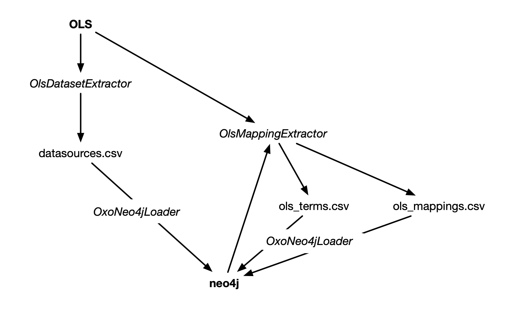

These Python scripts are used to 

1. To dump a list of datasources to CSV from identifiers.org, OLS, and UMLS (`OlsDatasetExtractor.py`)
2. To load this list of datasources from the the CSV generated in 1. to the neo4j database used by OxO (`OxoNeo4jLoader.py`)
3. To pull terms mappings from OLS and UMLS and generate CSV files (`OlsMappingExtractor.py`, `UmlsMappingExtractor.py`)
2. To load these terms and mappings into the neo4j database used by OxO (`OxoNeo4jLoader.py`)

</img>

They are configured by a config.ini file, an example of which is provided as
config.sample.ini.  The path to the config is passed using to each script using
the `-c` option.

# OlsDatasetExtractor

The `OlsDatasetExtractor.py` script pulls metadata about ontologies and databases
registered in OLS, identifiers.org and OBO xrefs, and generates a CSV file.

* OLS is accessed via its API, configurable in config.ini with the `olsurl` option

* The identifiers.org data is loaded from the idorg.xml file, configurable in config.ini with the `idorgDataLocation` option.
  This file is provided in the root of this repository.

* OBO xrefs are loaded from a yaml file, configurable in config.ini with the `oboDbxrefUrl` option

The CSV file is exported to the filename specified in the `exportFileDatasources` configuration option, or the -d command line option.
If specified, the command line option takes precedence over the config.ini option.

Example command (first, make sure neo4j is running with `docker-compose up -d neo4j`):

    docker run --net=host -v $(pwd)/config.ini:/mnt/config.ini -v $(pwd)/idorg.xml:/mnt/idorg.xml \
        -v oxo-neo4j-import:/mnt/neo4j -it ebispot/oxo-loader:stable \
            python /opt/oxo-loader/OlsDatasetExtractor.py \
                -c /mnt/config.ini -i /mnt/idorg.xml -d /mnt/neo4j/datasources.csv

The output CSV file has the form:

    "prefix","idorgNamespace","title","description","sourceType","baseUri","alternatePrefixes","licence","versionInfo"

For example:

    "DrugBank","drugbank","DrugBank","The DrugBank database is a bioinformatics and chemoinformatics resource that combines detailed drug (i.e. chemical, pharmacological and pharmaceutical) data with comprehensive drug target (i.e. sequence, structure, and pathway) information. This collection references drug information.","DATABASE","","drugbank,DRUGBANK,DrugBank","None","None"

This metadata can then be loaded into the OxO neo4j database using the `OxoNeo4jLoader.py` script.

    docker run --net=host -v $(pwd)/config.ini:/mnt/config.ini \
        -v oxo-neo4j-import:/var/lib/neo4j/import -it ebispot/oxo-loader:stable \
            python /opt/oxo-loader/OxoNeo4jLoader.py \
                -c /mnt/config.ini -W -d datasources.csv

# OlsMappingExtractor

After the metadata about datasets has been loaded into neo4j, the `OlsMappingExtractor.py` script is used to
pull mappings from OLS and generate two CSV files: one for terms, and one for mappings.  The terms CSV has the form:

    "identifier","curie","label","uri","prefix"

For example:

    "0012920","MONDO:0012920","type 1 diabetes mellitus 21","http://purl.obolibrary.org/obo/MONDO_0012920","MONDO"

And the mappings CSV has the form:

    "fromCurie","toCurie","datasourcePrefix","datasource","sourceType","scope","date"

For example:

    "MONDO:0012920","DOID:0110758","MONDO","{\"alternateIris\": [], \"name\": \"MONDO: Monarch Disease Ontology\", \"source\": \"ONTOLOGY\", \"idorgNamespace\": \"\", \"alternatePrefix\": [\"mondo\", \"MONDO\"], \"prefix\": \"MONDO\", \"licence\": \"https://creativecommons.org/licenses/by/4.0/\", \"orcid\": null, \"versionInfo\": \"Last updated in the ontology lookup service on 2019-05-27T04:26:17.673+0000\", \"preferredPrefix\": \"MONDO\"}","ONTOLOGY","RELATED","19-06-01"

OlsMappingExtractor uses the OxO API.  Therefore, both OxO and neo4j must be running.

    docker-compose up -d neo4j oxo-web

OlsMappingExtractor also requires access to a running **OLS** Solr instance (not the **OxO** Solr instance) configured with the olsSolrBaseUrl option. Note that this is different from the OLS API.  OlsMappingExtractor bypasses the OLS API and uses Solr directly, therefore making it impossible to use with the public OLS instance.
    
    docker run --net=host -v $(pwd)/config.ini:/mnt/config.ini \
        -v oxo-neo4j-import:/mnt/neo4j -it ebispot/oxo-loader:stable \
            python /opt/oxo-loader/OlsMappingExtractor.py \
                -c /mnt/config.ini -t /mnt/neo4j/ols_terms.csv -m /mnt/neo4j/ols_mappings.csv

These terms and mappings can then be loaded into neo4j using the `OxoNeo4jLoader.py` script:

    docker run --net=host -v $(pwd)/config.ini:/mnt/config.ini \
        -v oxo-neo4j-import:/var/lib/neo4j/import -it ebispot/oxo-loader:stable \
            python /opt/oxo-loader/OxoNeo4jLoader.py \
                -c /mnt/config.ini -t ols_terms.csv -m ols_mappings.csv

# UmlsMappingExtractor

Like the OlsMappingExtractor, the UmlsMappingExtractor is used to pull mappings from UMLS and generate
CSV files.  The UMLS MySQL database must be configured in config.ini.

    docker run --net=host -v $(pwd)/config.ini:/mnt/config.ini \
        -v oxo-neo4j-import:/var/lib/neo4j/import -it ebispot/oxo-loader:stable \
            python /opt/oxo-loader/UmlsMappingExtractor.py \
                -c /mnt/config.ini -t umls_terms.csv -m umls_mappings.csv

These terms and mappings can then be loaded into neo4j using the `OxoNeo4jLoader.py` script:

    docker run --net=host -v $(pwd)/config.ini:/mnt/config.ini \
        -v oxo-neo4j-import:/var/lib/neo4j/import -it ebispot/oxo-loader:stable \
            python /opt/oxo-loader/OxoNeo4jLoader.py \
                -c /mnt/config.ini -t umls_terms.csv -m umls_mappings.csv
